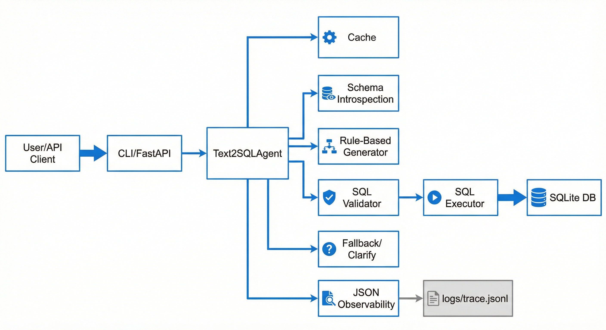

# enterprise-text-to-sql-agent

In enterprise Text-to-SQL, safety/validation/permissions matter more than generation.

This repository demonstrates an offline, enterprise-grade Text-to-SQL assistant focused on validation, guardrails, and evaluation. SQL generation is deterministic and rule-based by default, with an optional LLM adapter stubbed for future use. The agent answers KPI questions only and rejects non-KPI requests.



## 3-minute Quickstart

```bash
make setup
make init-db
make demo
make eval
make test
```

## What It Does

- KPI-only, rule-based SQL generation (deterministic templates)
- Strict validation: allowlist + denylist + linting rules
- Safe failures with structured error codes and clarification prompts
- Schema cache and query cache
- Evaluation harness with SQL match + exec match metrics
- JSON observability logs with trace IDs
- Optional FastAPI API with AgentOS-compatible streaming
- UI powered by agno-agi/agent-ui for a clean demo experience

## UI Demo

The UI is included under `ui/` and connects to the backend via AgentOS-compatible endpoints.

- UI: `https://enterprise-text-to-sql-agent-ui.fly.dev/?v=9`
- API: `https://enterprise-text-to-sql-agent.fly.dev`

Note: This is a public demo link. If abuse is a concern, add a token gate or an allowlist.

The UI shows:
- Answer
- Source rationale
- SQL
- Thinking steps:
  - Scope check
  - Schema grounding
  - SQL generation
  - Validation
  - Execution

## Demo Flow

1) Open the UI and select the default agent.
2) Click an example question (e.g., "Order fill rate last 30 days").
3) Observe:
   - Answer (bold)
   - Source rationale (italic)
   - SQL query (code block)
   - Thinking steps (Scope → Schema → SQL → Validation → Execution)
4) Try a non-KPI question to see a SAFE_ERROR response.

## Example Questions

See `examples/questions.md` for 10 sample questions.

## Example Outputs

SUCCESS:

```json
{
  "question": "order fill rate last 30 days",
  "outcome_type": "SUCCESS",
  "sql": "SELECT ROUND(SUM(filled_qty) * 1.0 / NULLIF(SUM(ordered_qty), 0), 4) AS value, 'ratio' AS unit FROM orders WHERE order_date >= date('now','-30 day')",
  "parameters": {},
  "rationale": "Order fill rate is filled_qty / ordered_qty over the time window.",
  "result": {
    "rows": [
      {
        "value": 0.8043,
        "unit": "ratio"
      }
    ],
    "summary": {
      "value": 0.8043,
      "unit": "ratio",
      "summary": "KPI value: 0.8043 ratio",
      "time_window": "last 30 days"
    }
  },
  "clarification": null,
  "message": null,
  "cache_hit": false
}
```

SAFE_ERROR (non-KPI):

```json
{
  "question": "what is the weather today?",
  "outcome_type": "SAFE_ERROR",
  "sql": null,
  "parameters": {},
  "rationale": "This agent only answers KPI questions. Examples: order fill rate, late ship rate, on-time delivery rate.",
  "result": {
    "errors": [
      {
        "error_code": "UNSAFE_QUESTION",
        "message": "This agent only answers KPI questions. Examples: order fill rate, late ship rate, on-time delivery rate."
      }
    ]
  },
  "clarification": null,
  "message": "I can only answer KPI questions. Try: order fill rate, late ship rate, on-time delivery rate."
}
```

CLARIFY:

```json
{
  "question": "order fill rate",
  "outcome_type": "CLARIFY",
  "sql": null,
  "parameters": {},
  "rationale": "KPI requires a time window to be meaningful.",
  "result": null,
  "clarification": "Which time window should I use (e.g., last 30 days, this month)?",
  "message": null,
  "cache_hit": false
}
```

## CLI Commands

```bash
python -m text2sql_agent.cli init-db
python -m text2sql_agent.cli ask "order fill rate last 30 days" --scope default
python -m text2sql_agent.cli show-schema
python -m text2sql_agent.cli eval
```

## API Endpoints

- `GET /healthz` and `GET /health`
- `GET /schema`
- `POST /ask` with JSON body `{"question": "...", "scope": "default"}`

AgentOS-compatible streaming:
- `GET /agents`
- `GET /teams`
- `GET /sessions`
- `GET /sessions/{session_id}/runs`
- `POST /agents/{agent_id}/runs` (streaming)

Rate limiting:
- 3 requests per person (IP + cookie) across `/ask` and `/agents/{agent_id}/runs`

## Security Posture

- Allowlist/denylist enforcement (tables, columns, dangerous verbs)
- SQL injection defenses (no comments, no semicolons, no system tables)
- Safe errors with remediation guidance
- Column restrictions for sensitive data

See `docs/SECURITY.md` for details.

## Metrics & Evaluation

Run:

```bash
python -m text2sql_agent.cli eval
```

Sample output:

```json
{
  "total_cases": 50,
  "sql_match_rate": 0.9,
  "exec_match_rate": 0.8,
  "clarify_precision": 0.9,
  "safe_error_rate": 0.9,
  "avg_latency_ms": 12.5,
  "cache_hit_rate": 0.02
}
```

## Architecture

Mermaid source: `docs/architecture.mmd`

## Data & Schema

- SQLite database at `data/app.db`
- Seeded schema: `data/seed.sql`
- KPI dictionary: `data/sample_kpis.md`

## Tradeoffs & Next steps

- Plug in Azure AI Foundry or Semantic Kernel for generation.
- Add RBAC and real identity context for permissioning.
- Expand to warehouse backends (Postgres, Snowflake).
- Add parser-based SQL validation for stronger security.

## Fly.io Deploy

Backend:

```bash
flyctl launch --name enterprise-text-to-sql-agent
flyctl deploy
```

UI:

```bash
cd ui
flyctl launch --name enterprise-text-to-sql-agent-ui
flyctl deploy
```
