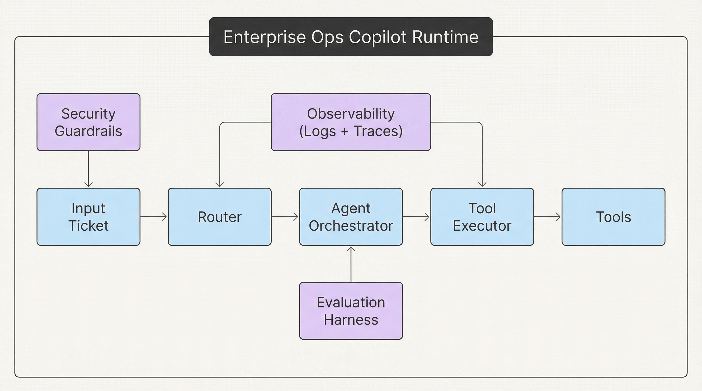

# mini-agent-runtime

Production-style agent runtime demo for an "Enterprise Ops Copilot" that routes support
tickets, calls tools, emits structured logs + traces, evaluates against a golden set, and
handles failures with retries/timeouts/circuit breakers.

## What this repo demonstrates

- Agent orchestration and routing across runbook/data/escalation workflows
- Generic tool interface with retries, timeouts, and circuit breakers
- Observability with structured JSON logs and trace events
- Evaluation harness with golden set and offline judge
- Security basics: PII redaction and prompt injection guardrails

## Architecture



More details in `docs/architecture.md`.

## 3-minute quickstart

```bash
make setup
make run
```

Run the demo and evaluation:

```bash
make demo
make test
```

Inspect a trace after running:

```bash
python -m runtime.cli show-trace <run_id>
```

## Demo GIF 
```

https://github.com/user-attachments/assets/bae4a188-65dc-4e22-889e-5905e34ab3cb


## Tradeoffs and next steps

- This baseline is deterministic and rule-based for local runs without API keys.
- Tools are in-memory mocks; replace with real services or data stores as needed.
- To plug in Azure AI Foundry or Semantic Kernel later, add an LLM adapter in
  `runtime/llm.py` and swap the router/agent implementations to call it.

## Commands

- `make setup` - install dependencies
- `make run` - run interactive CLI
- `make demo` - run sample tickets
- `make test` - run unit tests
- `make lint` - run ruff
- `python -m eval.run_eval` - run golden set evaluation
