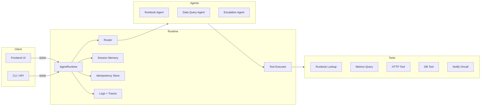
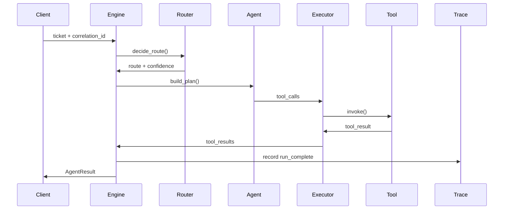
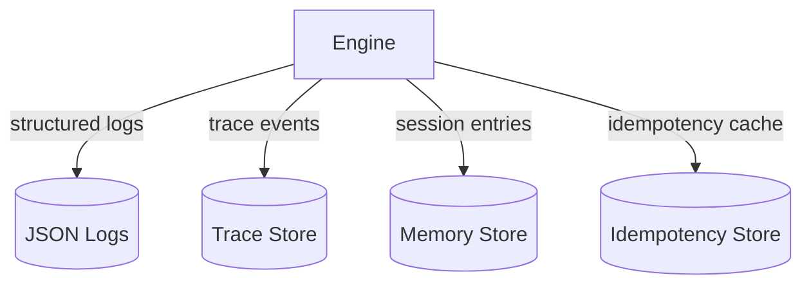

# Architecture

The runtime is designed as a small but production-style agent platform:

- `runtime/` orchestrates routing, tool execution, guardrails, memory/state, and idempotency.
- `agents/` define workflows and action plans.
- `tools/` implement generic tool calls with a shared interface.
- `observability/` provides JSON logs and trace event storage.
- `eval/` runs a golden set with a rule-based judge.

## Component view



## Run sequence (happy path)



## Observability + state



Traces are stored in memory and also persisted to `logs/traces.jsonl` so you can
inspect a run later using:

```
python -m runtime.cli show-trace <run_id>
```
