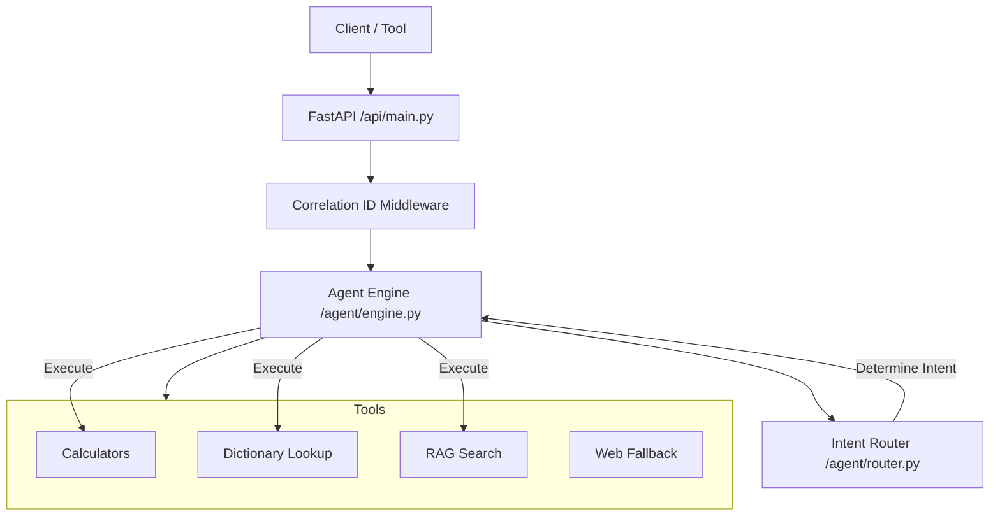

# Architecture

## System Overview
The SCM Agent is built following a modular, tool-augmented agent pattern.

## Core Components
- **FastAPI Layer**: Handles request/response, middleware for logging, and endpoint routing.
- **Intent Routing**: A deterministic (keyword) or probabilistic (LLM) router that classifies user queries into domains (Calculation, Definition, Planning).
- **Tool Orchestration**: The engine coordinates multiple tools. If internal knowledge (RAG/Dict) fails, it can fall back to web search.
- **Configuration**: Managed via `pydantic-settings` for robust environment variable validation.

## Deployment Info
- **Containerization**: Multi-stage Docker build optimized for size and security (non-root user).
- **Platform**: Fly.io for global edge deployment with automated health checks.
