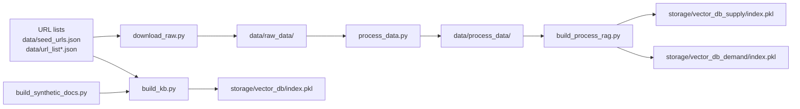
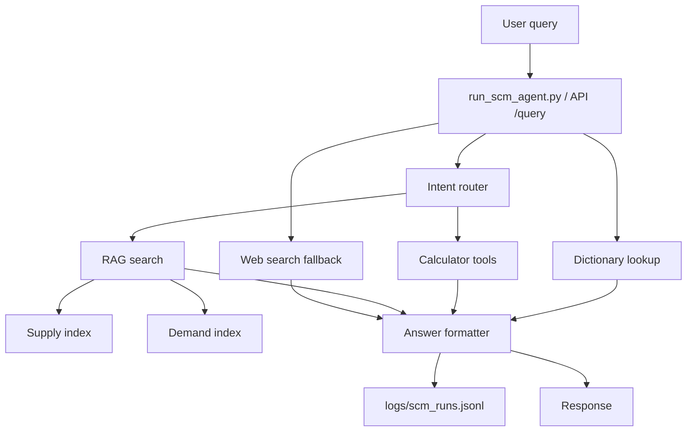

# SCM Agent AI Example

Production-style, fully local SCM enterprise agent with RAG, terminology dictionary,
intent routing, tool orchestration, structured logging, and evaluation.

## What it does
- TF-IDF RAG over SCM source documents
- Terminology dictionary with synonyms and fuzzy lookup
- Intent routing across SCM domains
- Tool orchestration (RAG + dictionary + calculators + web fallback)
- Structured JSONL logging and golden-set evaluation
- CLI runner and FastAPI service

## Requirements
- Python 3.10+

## Quickstart (local demo)
```bash
pip install -r requirements.txt
python build_kb.py
python run_scm_agent.py "What is OTIF and how is it measured?"
```

Run in interactive mode:
```bash
python run_scm_agent.py
```

## Full pipeline (supply/demand RAG)
Use this path if you want separate supply and demand indexes.
```bash
python download_raw.py
python process_data.py
python build_process_rag.py
```

## Data pipeline
### Raw data download
If any of the URL list files are present (`data/seed_urls.json`, `data/url_list.json`,
`data/url_list_supply.json`, `data/url_list_demand.json`), `download_raw.py` fetches
each URL and stores the original file in `data/raw_data/`.

### Process data (txt)
`process_data.py` converts files in `data/raw_data/` into plain-text documents in
`data/process_data/`.
- `pptx`: Gemini OCR (requires `GEMINI_API_KEY`, optional `GEMINI_MODEL`)
- `pdf/docx/html/txt/json`: local text extraction/cleanup

### Build supply/demand RAG
`build_process_rag.py` builds two vector indexes from `data/process_data/`:
- Supply index: `storage/vector_db_supply/index.pkl`
- Demand index: `storage/vector_db_demand/index.pkl`

The agent routes queries to supply/demand RAG when supply/demand keywords are detected.

### Build single-index KB (demo)
`build_kb.py` builds a single index at `storage/vector_db/index.pkl` from:
- Synthetic docs (`data/build_synthetic_docs.py`)
- Optional seed URLs (`data/seed_urls.json`) pulled into `data/raw_data/`

## Data structure (diagram)


## Architecture (diagram)


## API service (enterprise deploy)
Run the API server (expects prebuilt indexes):
```bash
uvicorn api.app:app --host 0.0.0.0 --port 8000
```

Open the demo UI in a browser:
- `http://localhost:8000/`

### API endpoints
- `GET /health` -> index readiness
- `POST /query` -> `{ "query": "...", "top_k": 3 }`
- `GET /` -> demo UI

## Environment variables
### Document processing
- `GEMINI_API_KEY`: required for PPTX OCR
- `GEMINI_MODEL`: default `gemini-1.5-flash`
- `PDF_TIMEOUT_SECONDS`: default `60`

### Index loading (API startup)
The API copies or downloads indexes into `INDEX_CACHE_DIR` via `index_loader.py`.
- `INDEX_CACHE_DIR`: default `cache/`
- `INDEX_BUCKET`: S3 bucket name (optional)
- `INDEX_PREFIX`: default `scm-agent-ai-example/indexes`
- `INDEX_SUPPLY_KEY`: full key override for supply index
- `INDEX_DEMAND_KEY`: full key override for demand index
- `AWS_REGION`: optional region for S3 client

## Evaluation and logging
```bash
python eval/eval_scm_agent.py
```
- Outputs are logged to `logs/scm_runs.jsonl`.

## Repository structure
```
scm-agent-ai-example/
  README.md
  requirements.txt
  Dockerfile
  .dockerignore
  download_raw.py
  process_data.py
  build_process_rag.py
  build_kb.py
  config.py
  index_loader.py
  run_scm_agent.py
  api/
    __init__.py
    app.py
  agent/
    __init__.py
    engine.py
    router.py
    prompts.py
  tools/
    __init__.py
    rag_search.py
    dictionary_lookup.py
    calculators.py
    web_search.py
  data/
    seed_urls.json
    url_list.json
    url_list_supply.json
    url_list_demand.json
    raw_data/
    process_data/
    enterprise_knowledge/
    build_synthetic_docs.py
    scm_dictionary.json
    scm_golden_set.json
  storage/
    vector_db/
    vector_db_supply/
    vector_db_demand/
  logs/
    scm_runs.jsonl
  eval/
    eval_scm_agent.py
  tests/
    test_router.py
    test_dictionary.py
```
